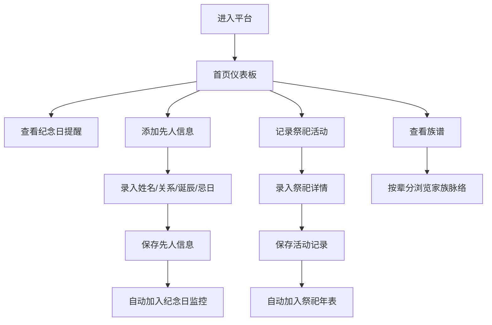

## 1. 产品概述

家族祭祀与先人纪念日管理平台，帮助家族成员记录和管理先人信息、祭祀活动，传承家族文化。

- 解决家族祭祀信息分散、纪念日容易遗忘、年轻一代对家族脉络不清晰的问题
- 目标用户为全家族成员，尤其是家族管理者和年轻一代

## 2. 核心功能

### 2.1 用户角色
| 角色 | 注册方式 | 核心权限 |
|------|---------|---------|
| 家族成员 | 本地使用，无需注册 | 浏览信息、记录活动、管理先人信息 |

### 2.2 功能模块
1. **首页仪表板**：纪念日提醒、最近祭祀活动、统计概览
2. **先人信息管理**：先人信息的增删改查（姓名、关系、忌日、诞辰）
3. **纪念日提醒**：临近纪念日自动提醒，支持设置提醒提前天数
4. **祭祀活动记录**：记录每次祭祀活动（时间、参与人、供品、墓地位置）
5. **家族祭祀年表**：按时间线展示所有祭祀活动
6. **族谱分支展示**：按辈分排列展示在世亲属关系和家族脉络
7. **家属成员管理**：管理在世家属成员信息

### 2.3 页面详情
| 页面名称 | 模块名称 | 功能描述 |
|---------|---------|---------|
| 首页 | 仪表板概览 | 展示即将到来的纪念日、最近祭祀活动、统计卡片 |
| 首页 | 快捷操作区 | 快速添加先人、记录祭祀、查看族谱 |
| 先人管理 | 先人列表 | 展示所有先人信息卡片，支持搜索筛选 |
| 先人管理 | 信息表单 | 添加/编辑先人信息（姓名、关系、忌日、诞辰、备注） |
| 祭祀记录 | 活动列表 | 展示所有祭祀活动，支持按时间筛选 |
| 祭祀记录 | 活动表单 | 记录祭祀活动详情（时间、参与人、供品、墓地位置、照片） |
| 祭祀年表 | 时间线展示 | 按年份时间线展示所有祭祀活动 |
| 族谱展示 | 族谱树 | 按辈分排列展示家族成员关系树 |
| 家属管理 | 成员列表 | 管理在世家属成员信息 |
| 系统设置 | 提醒设置 | 设置纪念日提醒提前天数、主题切换 |

## 3. 核心流程

用户进入平台后，可在首页查看即将到来的纪念日提醒。用户可以添加先人信息，设置诞辰和忌日。在纪念日临近时系统会显示提醒。用户可以记录每次祭祀活动的详细信息，包括参与人员、供品等。所有祭祀活动会自动整理成年表展示。用户还可以查看族谱树，了解家族脉络。

## 4. 用户界面设计

### 4.1 设计风格
- 主色调：深棕色 #8B4513（庄重、传统）搭配暖金色 #D4AF37（尊贵、纪念）
- 辅助色：米白色 #FAF0E6（温馨、怀旧）、深灰色 #2C2C2C（稳重）
- 按钮风格：圆角矩形，微立体阴影，hover时有轻微上浮效果
- 字体：标题使用 "Noto Serif SC"（宋体风格，庄重典雅），正文使用 "Noto Sans SC"（清晰易读）
- 布局风格：卡片式布局，左侧导航栏，顶部标题栏
- 图标风格：线性图标，简洁传统，配合适当的中国风装饰元素

### 4.2 页面设计概述
| 页面名称 | 模块名称 | UI元素 |
|---------|---------|--------|
| 首页 | 仪表板概览 | 渐变背景、统计卡片、倒计时提醒卡片、最近活动列表、柔和阴影、优雅过渡动画 |
| 先人管理 | 先人列表 | 卡片式展示，每张卡片有先人照片、姓名、生卒日期，悬停时显示详细信息 |
| 祭祀记录 | 活动列表 | 时间轴样式，左侧日期，右侧活动详情卡片 |
| 族谱展示 | 族谱树 | 树形结构，按辈分层级展示，连线连接，可展开折叠 |
| 祭祀年表 | 时间线 | 垂直时间线，按年份分组，每年的活动用卡片展示 |

### 4.3 响应式
- 桌面端优先设计，宽度 ≥ 1280px
- 平板端（768px - 1280px）：导航栏可折叠，卡片自适应宽度
- 移动端（< 768px）：底部导航栏，单列布局，优化触摸交互

### 4.4 动效设计
- 页面加载：元素淡入，卡片依次上浮
- 卡片悬停：轻微上浮，阴影加深
- 时间线滚动：滚动时渐显
- 族谱展开/折叠：平滑过渡动画
