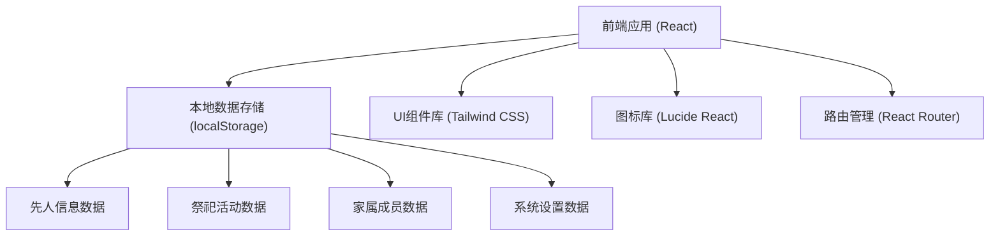
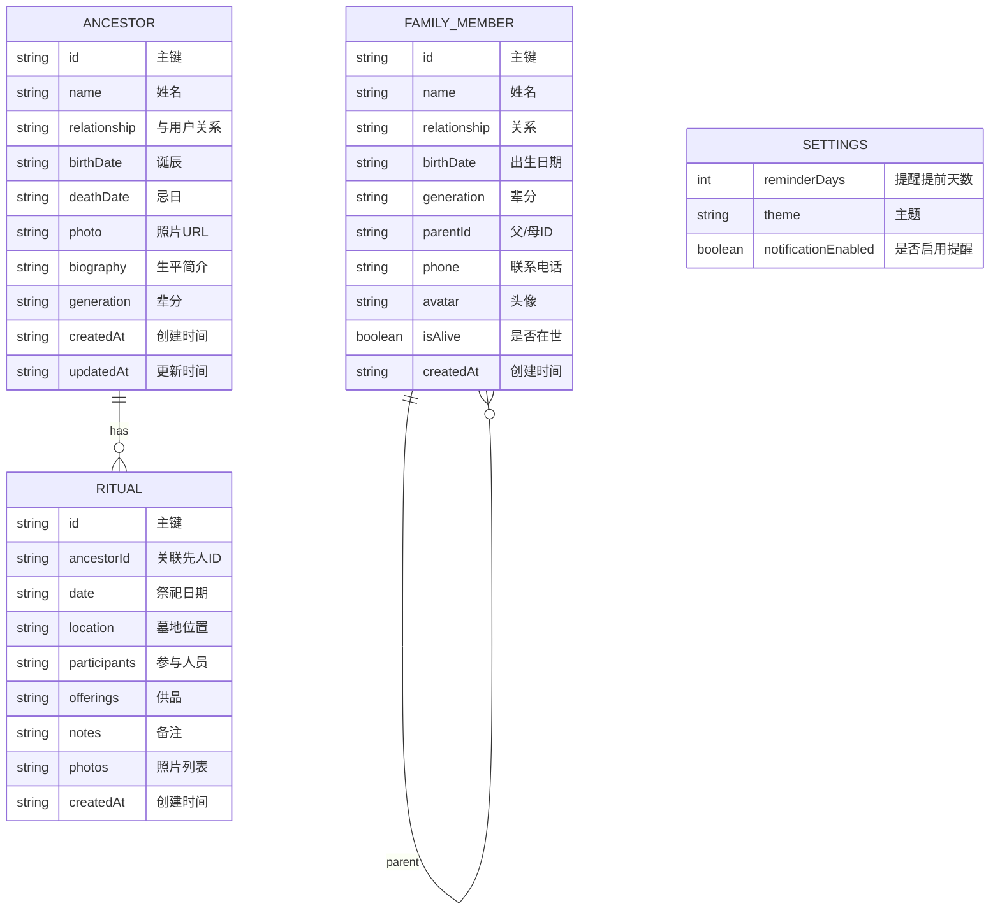

## 1. 架构设计



## 2. 技术描述

- 前端：React@18 + TypeScript + Tailwind CSS@3 + Vite@5
- 初始化工具：npm create vite@latest
- 后端：无（纯前端应用，数据存储在浏览器 localStorage）
- 数据库：localStorage（浏览器本地存储）
- 路由：React Router DOM@6
- 图标：Lucide React
- 状态管理：React useState + useContext

## 3. 路由定义

| 路由 | 页面 | 用途 |
|------|------|------|
| / | 首页 | 仪表板概览、纪念日提醒、快捷操作 |
| /ancestors | 先人管理 | 先人信息列表、添加/编辑先人 |
| /ancestors/new | 添加先人 | 添加新的先人信息表单 |
| /ancestors/:id/edit | 编辑先人 | 编辑指定先人信息 |
| /rituals | 祭祀记录 | 祭祀活动列表 |
| /rituals/new | 添加祭祀 | 记录新的祭祀活动 |
| /rituals/:id/edit | 编辑祭祀 | 编辑指定祭祀活动 |
| /timeline | 祭祀年表 | 按时间线展示所有祭祀活动 |
| /family-tree | 族谱展示 | 按辈分展示家族成员关系 |
| /members | 家属管理 | 管理在世家属成员 |
| /settings | 系统设置 | 提醒设置、数据管理 |

## 4. 数据模型

### 4.1 数据模型定义



### 4.2 本地存储结构

```typescript
// 先人信息
interface Ancestor {
  id: string;
  name: string;
  relationship: string;
  birthDate: string;
  deathDate: string;
  photo?: string;
  biography?: string;
  generation: number;
  createdAt: string;
  updatedAt: string;
}

// 祭祀活动
interface Ritual {
  id: string;
  ancestorId: string;
  ancestorName?: string;
  date: string;
  location: string;
  participants: string[];
  offerings: string[];
  notes?: string;
  photos?: string[];
  createdAt: string;
}

// 家族成员
interface FamilyMember {
  id: string;
  name: string;
  relationship: string;
  birthDate?: string;
  generation: number;
  parentId?: string;
  spouseId?: string;
  phone?: string;
  avatar?: string;
  isAlive: boolean;
  gender: 'male' | 'female';
  createdAt: string;
}

// 系统设置
interface AppSettings {
  reminderDays: number;
  theme: 'light' | 'dark';
  notificationEnabled: boolean;
}
```

## 5. 项目目录结构

```
src/
├── components/           # 公共组件
│   ├── Layout/          # 布局组件
│   ├── Card/            # 卡片组件
│   ├── Modal/           # 弹窗组件
│   ├── Timeline/        # 时间线组件
│   └── FamilyTree/      # 族谱树组件
├── pages/               # 页面组件
│   ├── Dashboard/       # 首页仪表板
│   ├── Ancestors/       # 先人管理
│   ├── Rituals/         # 祭祀记录
│   ├── Timeline/        # 祭祀年表
│   ├── FamilyTree/      # 族谱展示
│   ├── Members/         # 家属管理
│   └── Settings/        # 系统设置
├── context/             # 状态管理
│   ├── AppContext.tsx
│   └── StorageContext.tsx
├── hooks/               # 自定义Hooks
│   ├── useAncestors.ts
│   ├── useRituals.ts
│   ├── useMembers.ts
│   └── useReminder.ts
├── types/               # 类型定义
│   └── index.ts
├── utils/               # 工具函数
│   ├── storage.ts
│   ├── dateUtils.ts
│   └── mockData.ts
├── App.tsx
├── main.tsx
└── index.css
```

## 6. 核心功能实现思路

### 6.1 纪念日提醒
- 应用启动时计算所有先人的诞辰和忌日
- 与当前日期对比，计算距离纪念日的天数
- 根据设置的提醒提前天数，显示即将到来的纪念日
- 使用浏览器 Notification API 推送桌面通知（可选）

### 6.2 族谱展示
- 根据辈分（generation字段）对家族成员进行排序
- 构建树形数据结构，使用递归组件渲染
- 支持按代际展开/折叠
- 使用CSS绘制成员之间的连接线

### 6.3 数据持久化
- 使用 localStorage 存储所有数据
- 封装统一的 storage 工具函数
- 提供数据导出/导入功能（JSON格式）
- 预置示例数据方便用户快速体验
